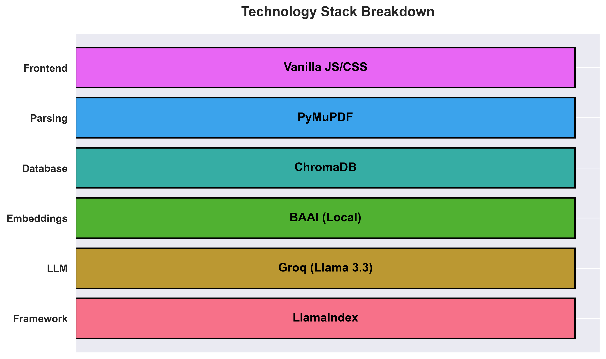
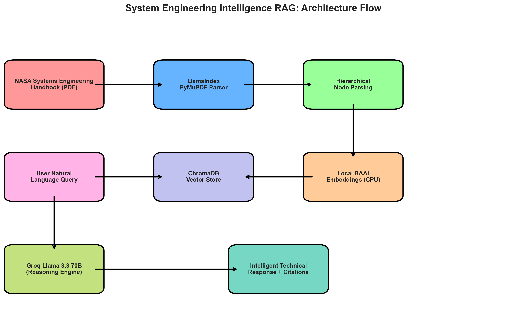

# 🌌 Systems Engineering Intelligence RAG (Public-Docs-Edition)

> **⚠️ DISCLAIMER:** This project is an independent AI software application. It is **NOT** an official system of the National Aeronautics and Space Administration (NASA), nor is it endorsed, reviewed, or authorized by NASA. All responses are generated by an Artificial Intelligence model (Groq/Llama) and may contain inaccuracies. NASA is not responsible for the accuracy of information generated by this tool. This tool "includes NASA source material" (specifically SP-2016-6105 Rev2) provided under public domain.

## 💡 The Inspiration
Technical manuals are notoriously difficult for standard AI models. You have 270+ pages of dense engineering logic, cross-references that jump across chapters, and acronyms that look like secret codes (TRL, KDP, CDR...). 

I built this project to prove that **RAG (Retrieval-Augmented Generation)** can handle more than just simple paragraphs. This system "understands" the hierarchy of a technical handbook, resolving parent-child relationships and connecting logic from one chapter to another.

---

## 🛠️ The Technology Stack
I chose a high-performance stack to ensure the agent is both accurate and lightning-fast.



- **LlamaIndex:** The backbone of our data orchestration.
- **Groq (Llama 3.3 70B):** Used as the primary reasoning engine for near-instant responses.
- **BAAI Embeddings:** Running locally on your CPU—no API costs, high security.
- **ChromaDB:** A robust vector database to store our technical knowledge.

---

## 📐 Architecture & Logic Flow
How does it actually work? When you ask a question, the system doesn't just search for keywords. It looks at the **structure** of the manual.



1. **Ingestion:** The PDF is parsed using layout-aware tools.
2. **Hierarchical Parsing:** Instead of arbitrary chunks, we maintain the relationship between sections (e.g., Section 6.2 knows it belongs to Chapter 6).
3. **Multi-Hop Reasoning:** Complex queries are broken down into sub-questions, allowing the AI to "read" different sections before synthesizing a final answer.
4. **Acronym Resolution:** Automatically expands shorthand so the vector search never misses a hit.

---

## 🚀 Key Features
- **Hierarchical Context:** No more "lost context"—the AI knows exactly where in the manual it is reading.
- **Citation Precision:** Every answer comes with the specific **Section** and **Page Number**.
- **Acronym Awareness:** TRL? KDP? SRR? The AI handles them all without breaking a sweat.
- **100% Stable:** Engineered to bypass common API 404s and library conflicts.

---

## 🚦 Getting Started (Manual Setup)

### 1. Configure Environment
Open `backend/.env` and add your **Groq API Key**:
```text
GROQ_API_KEY=your_key_here
```

### 2. Launch the Engine
Open your terminal and run:
```powershell
cd backend
.\venv\Scripts\activate
python main.py
```

### 3. Use the Assistant
1. Open `http://localhost:8000` in your browser.
2. Click the **Meteorite Icon** (Deploy Dataset) to start the local indexing.
3. Once finished, start asking technical questions!

---

*This project was developed to demonstrate advanced RAG capabilities on complex, public-domain government technical documentation.*
